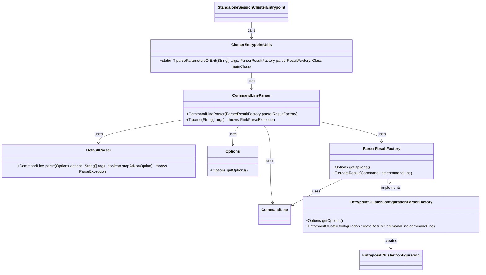
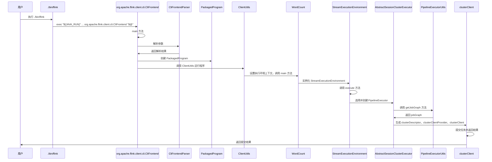

```mermaid
classDiagram
    class ClusterEntrypointUtils {
        +static <T> T parseParametersOrExit(String[] args, ParserResultFactory<T> parserResultFactory, Class<?> mainClass)
    }

    class CommandLineParser {
        +CommandLineParser(ParserResultFactory<T> parserResultFactory)
        +T parse(String[] args) throws FlinkParseException
    }

    class DefaultParser {
        +CommandLine parse(Options options, String[] args, boolean stopAtNonOption) throws ParseException
    }

    class Options {
        +Options getOptions()
    }

    class CommandLine {
    }

    class ParserResultFactory {
        +Options getOptions()
        +T createResult(CommandLine commandLine)
    }

    class EntrypointClusterConfigurationParserFactory {
        +Options getOptions()
        +EntrypointClusterConfiguration createResult(CommandLine commandLine)
    }

    class EntrypointClusterConfiguration {
    }

    class StandaloneSessionClusterEntrypoint {
    }

    ClusterEntrypointUtils --> CommandLineParser : uses
    CommandLineParser --> DefaultParser : uses
    CommandLineParser --> Options : uses
    CommandLineParser --> CommandLine : uses
    CommandLineParser --> ParserResultFactory : uses
    ParserResultFactory <|-- EntrypointClusterConfigurationParserFactory : implements
    ParserResultFactory --> CommandLine : uses
    EntrypointClusterConfigurationParserFactory --> EntrypointClusterConfiguration : creates
    StandaloneSessionClusterEntrypoint --> ClusterEntrypointUtils : calls
```

```mermaid
sequenceDiagram
    participant User as 用户
    participant FlinkBin as ./bin/flink
    participant CliFrontend as org.apache.flink.client.cli.CliFrontend
    participant CliFrontendParser as CliFrontendParser
    participant PackagedProgram as PackagedProgram
    participant ClientUtils as ClientUtils
    participant WordCount as WordCount
    participant StreamExecutionEnvironment as StreamExecutionEnvironment
    participant PipelineExecutor as AbstractSessionClusterExecutor
    participant PipelineExecutorUtils as PipelineExecutorUtils
    participant ClusterClient as clusterClient

    User ->> FlinkBin: 执行 ./bin/flink
    FlinkBin ->> CliFrontend: exec "${JAVA_RUN}" ... org.apache.flink.client.cli.CliFrontend "$@"
    CliFrontend ->> CliFrontend: main 方法
    CliFrontend ->> CliFrontendParser: 解析参数
    CliFrontendParser ->> CliFrontend: 返回解析结果
    CliFrontend ->> PackagedProgram: 创建 PackagedProgram
    CliFrontend ->> ClientUtils: 调用 ClientUtils 运行程序
    ClientUtils ->> WordCount: 设置执行环境上下文，调用 main 方法
    WordCount ->> StreamExecutionEnvironment: 实例化 StreamExecutionEnvironment
    StreamExecutionEnvironment ->> StreamExecutionEnvironment: 调用 execute 方法
    StreamExecutionEnvironment ->> PipelineExecutor: 选择并创建 PipelineExecutor
    PipelineExecutor ->> PipelineExecutorUtils: 调用 getJobGraph 方法
    PipelineExecutorUtils ->> PipelineExecutor: 返回 jobGraph
    PipelineExecutor ->> ClusterClient: 生成 clusterDescriptor、clusterClientProvider、clusterClient
    ClusterClient ->> ClusterClient: 提交任务并返回结果
    ClusterClient ->> User: 返回提交结果
```