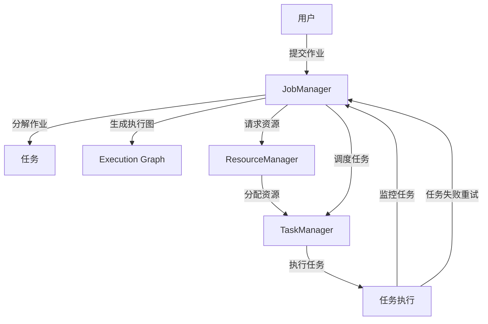
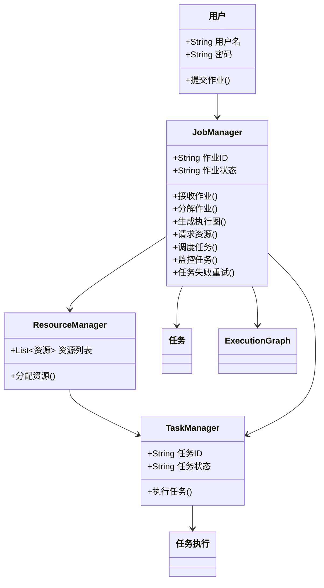

# 主要功能分析与建模

## 0. Flink简介

### 0.1 Flink的历史

2010 年，由Volker Markl领导的研究项目“Stratosphere：云端信息管理” （由德国研究基金会 (DFG)资助）由柏林工业大学、柏林洪堡大学和波茨坦哈索普拉特纳研究所合作启动。Flink 最初是从 Stratosphere 的分布式执行引擎的一个分支开始的，并于 2014 年 3 月成为 Apache 孵化器项目。2014 年 12 月，Flink 被接受为 Apache 顶级项目。

### 0.2 概述

Apache Flink是由Apache 软件基金会开发的开源、统一的流处理和批处理框架。Apache Flink 的核心是一个用Java和Scala编写的分布式流数据流引擎。Flink以数据并行和流水线（因此是任务并行）的方式执行任意数据流程序。Flink 的流水线运行时系统支持执行批量/批处理和流处理程序。此外，Flink 的运行时原生支持执行迭代算法。

Flink 提供高吞吐量、低延迟的流式处理引擎，并支持事件时间处理和状态管理。Flink 应用程序在机器故障时具有容错能力，并支持一次性语义。程序可以用Java、Scala、 Python、和SQL 编写，并自动编译和优化为在集群或云环境中执行的数据流程序。

Flink 不提供自己的数据存储系统，但为 Apache Doris、Amazon Kinesis、Apache Kafka、HDFS、Apache Cassandra和ElasticSearch等系统提供数据源和接收器连接器。

## 1. 功能分析

### 1.1 流处理与批处理

在大数据和数据分析的世界中，批量数据处理和流数据处理是非常重要的概念。一般来说，在批处理中，数据是先收集然后处理的，而流处理是实时的，数据是分段发送到分析工具中的。

批处理通常适用于不需要实时分析的场景，以及处理大量数据的能力比处理所述数据的速度更重要的场景（可以接受较慢的分析结果，比如：账单、客户订单、工资单等）

流计算就是对源源不断的数据进行计算，中间的计算结果存放在内存或者外部存储，这就是有状态计算。使用数据流将其输入分析工具，在生成数据的那一刻，就能够获得几乎即时的结果。流处理的延迟通常以秒或毫秒为单位，因为在流处理中，数据在到达磁盘之前会被分析。

Flink就是个实时处理数据任务的框架，这个框架帮助开发者执行数据处理的任务，让开发者无需关心高可用、性能等问题。如果有一些数据任务需要执行，比如数据监控、数据分析、数据同步，那就可以考虑使用Flink。

这里我们直接使用flink官方给出的批处理和流处理的示例：

批处理：
```java
// pojo class WordWithCount
public class WordWithCount {
    public String word;
    public int count;

    public WordWithCount() {}

    public WordWithCount(String word, int count) {
        this.word = word;
        this.count = count;
    }
}

// main method
StreamExecutionEnvironment env = StreamExecutionEnvironment.getExecutionEnvironment();
env.setRuntimeMode(RuntimeExecutionMode.BATCH);
FileSource<String> source = FileSource.forRecordStreamFormat(new TextLineInputFormat(), new Path("MyInput.txt")).build();
DataStreamSource<String> text = env.fromSource(source, WatermarkStrategy.noWatermarks(), "MySource");
DataStream<WordWithCount> windowCounts = text
        .flatMap((FlatMapFunction<String, String>) (line, collector) -> Arrays
                .stream(line.split("\\s"))
                .forEach(collector::collect)).returns(String.class)
        .map(word -> new WordWithCount(word, 1)).returns(TypeInformation.of(WordWithCount.class))
        .keyBy(wordWintCount -> wordWintCount.word)
        .sum("count").returns(TypeInformation.of(WordWithCount.class));

windowCounts.print();
env.execute();

```

流处理：

```java
// pojo class WordWithCount
public class WordWithCount {
    public String word;
    public int count;

    public WordWithCount() {}
    
    public WordWithCount(String word, int count) {
        this.word = word;
        this.count = count;
    }
}

// main method
StreamExecutionEnvironment env = StreamExecutionEnvironment.getExecutionEnvironment();
DataStreamSource<String> text = env.socketTextStream(host, port);
DataStream<WordWithCount> windowCounts = text
    .flatMap(
        (FlatMapFunction<String, String>) (line, collector) 
            -> Arrays.stream(line.split("\\s")).forEach(collector::collect)
    ).returns(String.class)
    .map(word -> new WordWithCount(word, 1)).returns(TypeInformation.of(WordWithCount.class))
    .keyBy(wordWithCnt -> wordWithCnt.word)
    .window(TumblingProcessingTimeWindows.of(Duration.ofSeconds(5)))
    .sum("count").returns(TypeInformation.of(WordWithCount.class));

windowCounts.print();
env.execute();

```
我们比较两个代码之间不一样的地方：

批处理通过FileSource读取静态文件MyInput.txt中的数据，适用于一次性静态数据的处理。而流处理使用socketTextStream从套接字接收数据，适用于实时动态数据流。流处理的数据源持续不断，常用于接收实时事件。同时流处理使用了滚动窗口TumblingProcessingTimeWindows，每隔5秒统计一次单词数量。窗口操作是流处理中常用的机制，适合对无穷数据流进行分段处理。而批处理并不需要窗口操作。

### 1.2 Flink的主要功能与优点

#### 1.2.1 Flink的主要功能

Flink是一个框架和分布式处理引擎，用于对无边界和有边界的数据流进行有状态的计算。Flink是原生的流处理系统，但也提供了批处理API，用于基于流式计算引擎处理批量数据的计算能力，真正实现了批流统一。

#### 1.2.2 Flink的优点

Flink支持有状态的计算。
Flink支持事件时间。
Flink支持高可用性。
Flink吞吐量高。
Flink容错性好。
Flink提供了不同层级的API。

#### 1.2.3 Flink的应用场景

事件驱动：根据到来的事件流触发计算、状态更新或其他外部动作。主要应用实例有反欺诈、异常检测、基于规则的报警、业务流程监控等。

数据分析：从原始数据中提取有价值的信息和指标，这些信息和指标数据可以写入外部数据库系统或以内部状态的形式维护。

数据管道：数据管道和ETL（Extract-Transform-Load，提取-转换-加载）作业的用途相似，都可以转换、丰富数据，并将其从某个存储系统移动到另一个。与传统的ETL不同的是，传统的ETL是周期性的，而Flink是以持续流模式运行的。

### 1.3 Flink运行流程

1.作业提交：用户编写Flink应用程序（包括数据源、数据处理逻辑、结果输出等）,然后通过StreamExecutionEnvironment.execute()提交作业，该代码会将应用逻辑打包成一个Flink JobGraph提交到Flink集群。

2.Flink编译并优化用户代码，将应用逻辑转化为JobGraph（作业图）

3.Flink的Client接收用户的JobGraph并与集群交互，将作业提交到JobManager（作业管理器）

4.JobManager接收JobGraph后，将其转化为ExecutionGraph（执行图），并根据Flink的优化策略生成最优的执行计划。

5.JobManager向资源管理器（ResourceManager）请求资源。ResourceManager从集群节点中分配TaskManagers来执行作业。一旦资源分配完毕，JobManager将每个Task分发给相应的TaskManager。

6.每个TaskManager作为集群节点的工作单元，负责在各自的Slot中执行分配的任务。TaskManager执行算子并通过网络传输上下游任务之间的数据，形成实际的数据流。

7.任务在TaskManager上执行过程中，Flink会通过DataStream API和DataSet API来管理数据流。在流处理作业中，Flink使用状态（State）管理中间结果，处理断点恢复（通过Checkpoints）以确保数据一致性。如果启用了Event Time或Watermark，Flink会基于事件时间进行窗口操作或延迟处理。

8.Flink支持容错机制，通过检查点（Checkpoints）和快照（Savepoints）来保存作业的状态。若发生任务失败，JobManager会重新启动失败的任务，并从上次的检查点或快照恢复数据，保证处理的准确性。

9.数据流处理完成后，结果将按照用户配置写入指定的输出端（如数据库、文件系统或消息队列等）。批处理作业会输出所有计算后的数据；流处理作业会实时输出每批计算后的结果。

10.批处理作业执行完所有计算任务后自动停止并释放资源。流处理作业通常会持续运行直到手动取消，在取消或完成后，JobManager会通知TaskManager释放资源。


## 2. 功能建模

### 2.1 用例图
用例图用于展示 Flink 调度机制的主要功能及其与用户的交互关系。



### 2.2 类图

