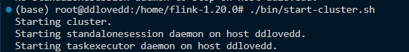
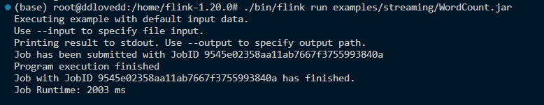
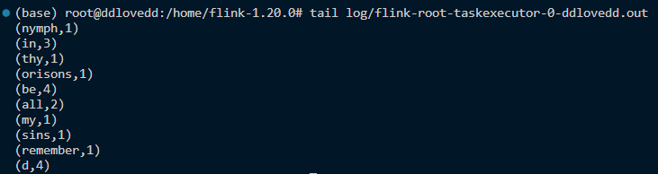
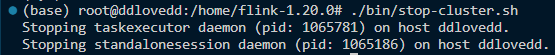
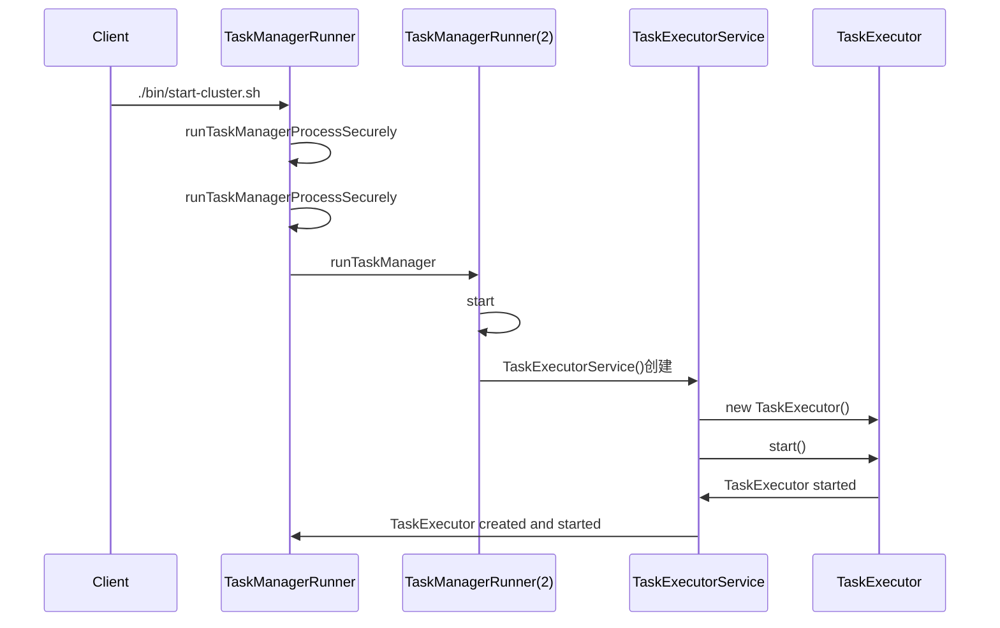
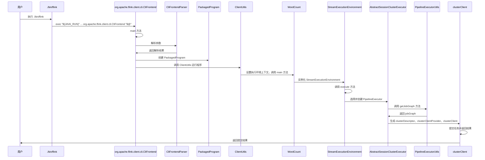

# 核心流程设计分析

## 0 Flink启动

运行脚本文件 start-cluster.sh，以单机模式在本地部署Flink，如下图所示：



在该脚本文件当中，运行了两个main函数，分别是：

org.apache.flink.runtime.entrypoint.StandaloneSessionClusterEntrypoint(位于flink-runtime\src\main\java\org\apache\flink\runtime\entrypoint\SessionClusterEntrypoint.java)
它的作用是启动包含JobManager和TaskManager的Flink集群。

org.apache.flink.runtime.taskexecutor.TaskManagerRunner(位于flink-runtime\src\main\java\org\apache\flink\runtime\taskexecutor\TaskManagerRunner.java)
它的作用是启动TaskManager。

## 1 WordCount

我们还是使用给出的一个例子那就是wordcount来说明提交作业这一过程：

```java
public class WordCount {

    // *************************************************************************
    // PROGRAM
    // *************************************************************************

    public static void main(String[] args) throws Exception {
        final CLI params = CLI.fromArgs(args);

        // Create the execution environment. This is the main entrypoint
        // to building a Flink application.
        final StreamExecutionEnvironment env = StreamExecutionEnvironment.getExecutionEnvironment();

        // Apache Flink’s unified approach to stream and batch processing means that a DataStream
        // application executed over bounded input will produce the same final results regardless
        // of the configured execution mode. It is important to note what final means here: a job
        // executing in STREAMING mode might produce incremental updates (think upserts in
        // a database) while in BATCH mode, it would only produce one final result at the end. The
        // final result will be the same if interpreted correctly, but getting there can be
        // different.
        //
        // The “classic” execution behavior of the DataStream API is called STREAMING execution
        // mode. Applications should use streaming execution for unbounded jobs that require
        // continuous incremental processing and are expected to stay online indefinitely.
        //
        // By enabling BATCH execution, we allow Flink to apply additional optimizations that we
        // can only do when we know that our input is bounded. For example, different
        // join/aggregation strategies can be used, in addition to a different shuffle
        // implementation that allows more efficient task scheduling and failure recovery behavior.
        //
        // By setting the runtime mode to AUTOMATIC, Flink will choose BATCH if all sources
        // are bounded and otherwise STREAMING.
        env.setRuntimeMode(params.getExecutionMode());

        // This optional step makes the input parameters
        // available in the Flink UI.
        env.getConfig().setGlobalJobParameters(params);

        DataStream<String> text;
        if (params.getInputs().isPresent()) {
            // Create a new file source that will read files from a given set of directories.
            // Each file will be processed as plain text and split based on newlines.
            FileSource.FileSourceBuilder<String> builder =
                    FileSource.forRecordStreamFormat(
                            new TextLineInputFormat(), params.getInputs().get());

            // If a discovery interval is provided, the source will
            // continuously watch the given directories for new files.
            params.getDiscoveryInterval().ifPresent(builder::monitorContinuously);

            text = env.fromSource(builder.build(), WatermarkStrategy.noWatermarks(), "file-input");
        } else {
            text = env.fromData(WordCountData.WORDS).name("in-memory-input");
        }

        DataStream<Tuple2<String, Integer>> counts =
                // The text lines read from the source are split into words
                // using a user-defined function. The tokenizer, implemented below,
                // will output each word as a (2-tuple) containing (word, 1)
                text.flatMap(new Tokenizer())
                        .name("tokenizer")
                        // keyBy groups tuples based on the "0" field, the word.
                        // Using a keyBy allows performing aggregations and other
                        // stateful transformations over data on a per-key basis.
                        // This is similar to a GROUP BY clause in a SQL query.
                        .keyBy(value -> value.f0)
                        // For each key, we perform a simple sum of the "1" field, the count.
                        // If the input data stream is bounded, sum will output a final count for
                        // each word. If it is unbounded, it will continuously output updates
                        // each time it sees a new instance of each word in the stream.
                        .sum(1)
                        .name("counter");

        if (params.getOutput().isPresent()) {
            // Given an output directory, Flink will write the results to a file
            // using a simple string encoding. In a production environment, this might
            // be something more structured like CSV, Avro, JSON, or Parquet.
            counts.sinkTo(
                            FileSink.<Tuple2<String, Integer>>forRowFormat(
                                            params.getOutput().get(), new SimpleStringEncoder<>())
                                    .withRollingPolicy(
                                            DefaultRollingPolicy.builder()
                                                    .withMaxPartSize(MemorySize.ofMebiBytes(1))
                                                    .withRolloverInterval(Duration.ofSeconds(10))
                                                    .build())
                                    .build())
                    .name("file-sink");
        } else {
            counts.print().name("print-sink");
        }

        // Apache Flink applications are composed lazily. Calling execute
        // submits the Job and begins processing.
        env.execute("WordCount");
    }

    // *************************************************************************
    // USER FUNCTIONS
    // *************************************************************************

    /**
     * Implements the string tokenizer that splits sentences into words as a user-defined
     * FlatMapFunction. The function takes a line (String) and splits it into multiple pairs in the
     * form of "(word,1)" ({@code Tuple2<String, Integer>}).
     */
    public static final class Tokenizer
            implements FlatMapFunction<String, Tuple2<String, Integer>> {

        @Override
        public void flatMap(String value, Collector<Tuple2<String, Integer>> out) {
            // normalize and split the line
            String[] tokens = value.toLowerCase().split("\\W+");

            // emit the pairs
            for (String token : tokens) {
                if (token.length() > 0) {
                    out.collect(new Tuple2<>(token, 1));
                }
            }
        }
    }
}

```

使用如下命令提交作业：



然后我们可以检查作业情况：这里我们输入tail log/flink-* -taskexecutor- *.out，其中两个星号可详见log文件夹下的文件。



最后我们运行./bin/stop-cluster.sh脚本即可快速停止集群和所有正在运行的组件。



## 2 创建集群

接下来我们仔细研究一下创建集群的这两个函数：

### 2.1_org.apache.flink.runtime.entrypoint.StandaloneSessionClusterEntrypoint.java


### 2.2_org.apache.flink.runtime.taskexecutor.TaskManagerRunner.java

该文件是为了启动TaskManager，我们还是顺着流程看一看。

```java
public static void main(String[] args) throws Exception {
        // startup checks and logging
        EnvironmentInformation.logEnvironmentInfo(LOG, "TaskManager", args);
        SignalHandler.register(LOG);
        JvmShutdownSafeguard.installAsShutdownHook(LOG);

        long maxOpenFileHandles = EnvironmentInformation.getOpenFileHandlesLimit();

        if (maxOpenFileHandles != -1L) {
            LOG.info("Maximum number of open file descriptors is {}.", maxOpenFileHandles);
        } else {
            LOG.info("Cannot determine the maximum number of open file descriptors");
        }

        runTaskManagerProcessSecurely(args);
    }
```

前面的这一段代码的主要用途是进行启动时的环境检查和日志记录。和之前介绍类似，就不过多赘述，然后运行runTaskManagerProcessSecurely(args)。

```java
public static void runTaskManagerProcessSecurely(String[] args) {
        Configuration configuration = null;

        try {
            configuration = loadConfiguration(args);
        } catch (FlinkParseException fpe) {
            LOG.error("Could not load the configuration.", fpe);
            System.exit(FAILURE_EXIT_CODE);
        }

        runTaskManagerProcessSecurely(checkNotNull(configuration));
    }
```

接下来会加载配置文件，如果加载失败会报错，最后运行一个重构的runTaskManagerProcessSecurely。

接下来的函数以及类的代码都非常长，这里就不完全复制粘贴代码，更多讲解每一段代码具体干了什么，来干啥这个整体流程。

首先该函数会根据配置文件来初始化一个PluginManager类，该类可以管理和加载插件。

```java
final PluginManager pluginManager =
                PluginUtils.createPluginManagerFromRootFolder(configuration);
```

然后根据配置文件和PluginManager运行runTaskManager函数。

在该函数中，会再次实例一个TaskManagerRunner类，并运行start函数。

```java
try {
            taskManagerRunner =
                    new TaskManagerRunner(
                            configuration,
                            pluginManager,
                            TaskManagerRunner::createTaskExecutorService);
            taskManagerRunner.start();
        } catch (Exception exception) {
            throw new FlinkException("Failed to start the TaskManagerRunner.", exception);
        }
```

start函数如下：

```java
public void start() throws Exception {
        synchronized (lock) {
            startTaskManagerRunnerServices();
            taskExecutorService.start();
        }
    }
```

这里我们看到一个lock，它的作用是lock 的作用是确保在启动任务管理器运行器时的操作是互斥的，以避免并发问题。

startTaskManagerRunnerServices()方法是启动TaskManagerRunner的相关服务。其中有一部分是创造了一个taskExecutorService。

```java
taskExecutorService =
                    taskExecutorServiceFactory.createTaskExecutor(
                            this.configuration,
                            this.resourceId.unwrap(),
                            rpcService,
                            highAvailabilityServices,
                            heartbeatServices,
                            metricRegistry,
                            blobCacheService,
                            false,
                            externalResourceInfoProvider,
                            workingDirectory.unwrap(),
                            this,
                            delegationTokenReceiverRepository);
```

接下来使用taskExecutorService.start，启动一个TaskExecutorService类，然后在TaskExecutorService类当中会启动一个TaskExecutor类，至此，TaskManager创建并启动完毕。我们画一个时序图来表示这个过程：



## 3 提交作业

运行./bin/flink 后，运行了 org.apache.flink.client.cli.CliFrontend 的main方法(位于flink-clients/src/main/java/org/apache/flink/client/cli/CliFrontend.java路径下),其作用是为用户提供了一个交互式的方式来管理和提交Flink作业。

#### 3.1 解析参数

解析参数，选择Default命令行接口，然后调用命令行接口继续运行。命令行接口会调用CliFrontendParser解析参数，打包有效配置，创建PackagedProgram。

#### 3.2 调用作业的main方法

调用ClientUtils运行程序，设置执行环境的上下文，然后执行作业WordCount的main方法。

#### 3.3 调用执行环境的execute方法
WordCount会运行如下代码获取一个流执行环境

    final StreamExecutionEnvironment env = StreamExecutionEnvironment.getExecutionEnvironment();

然后调用其execute方法。

#### 3.4 生成jobGraph和clusterClient

流执行环境会调用getStreamGraph得到streamGraph，选择并创建PipelineExecutor。

PipelineExecutor调用PipelineExecutorUtils的 getJobGraph方法得到jobGraph。然后通过工厂模式依次生成clusterDescriptor、clusterClientProvider、clusterClient。

#### 3.5 提交作业并返回结果

clusterClient提交任务到集群，并且返回提交结果，随后作业WordCount在集群上开始运行。

可用下流程图来表示上述流程：




