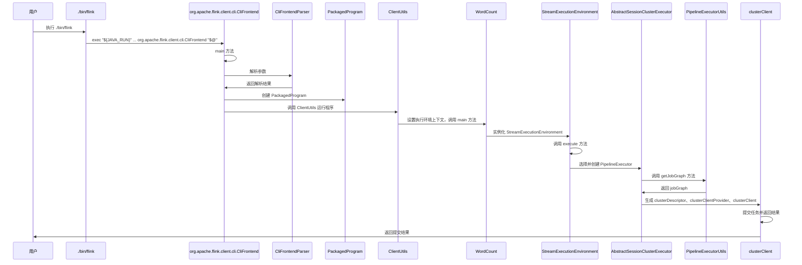

# 核心流程设计分析

## 0 Flink启动

运行脚本文件 start-cluster.sh，以单机模式在本地部署Flink，如下图所示：


在该脚本文件当中，运行了两个main函数，分别是：

org.apache.flink.runtime.entrypoint.StandaloneSessionClusterEntrypoint(位于flink-runtime\src\main\java\org\apache\flink\runtime\entrypoint\SessionClusterEntrypoint.java)
它的作用是启动包含JobManager和TaskManager的Flink集群。

org.apache.flink.runtime.taskexecutor.TaskManagerRunner(位于flink-runtime\src\main\java\org\apache\flink\runtime\taskexecutor\TaskManagerRunner.java)
它的作用是启动TaskManager。

## 1 WordCount

我们还是使用给出的一个例子那就是wordcount来说明提交作业这一过程：

```java
public class WordCount {

    // *************************************************************************
    // PROGRAM
    // *************************************************************************

    public static void main(String[] args) throws Exception {
        final CLI params = CLI.fromArgs(args);

        // Create the execution environment. This is the main entrypoint
        // to building a Flink application.
        final StreamExecutionEnvironment env = StreamExecutionEnvironment.getExecutionEnvironment();

        // Apache Flink’s unified approach to stream and batch processing means that a DataStream
        // application executed over bounded input will produce the same final results regardless
        // of the configured execution mode. It is important to note what final means here: a job
        // executing in STREAMING mode might produce incremental updates (think upserts in
        // a database) while in BATCH mode, it would only produce one final result at the end. The
        // final result will be the same if interpreted correctly, but getting there can be
        // different.
        //
        // The “classic” execution behavior of the DataStream API is called STREAMING execution
        // mode. Applications should use streaming execution for unbounded jobs that require
        // continuous incremental processing and are expected to stay online indefinitely.
        //
        // By enabling BATCH execution, we allow Flink to apply additional optimizations that we
        // can only do when we know that our input is bounded. For example, different
        // join/aggregation strategies can be used, in addition to a different shuffle
        // implementation that allows more efficient task scheduling and failure recovery behavior.
        //
        // By setting the runtime mode to AUTOMATIC, Flink will choose BATCH if all sources
        // are bounded and otherwise STREAMING.
        env.setRuntimeMode(params.getExecutionMode());

        // This optional step makes the input parameters
        // available in the Flink UI.
        env.getConfig().setGlobalJobParameters(params);

        DataStream<String> text;
        if (params.getInputs().isPresent()) {
            // Create a new file source that will read files from a given set of directories.
            // Each file will be processed as plain text and split based on newlines.
            FileSource.FileSourceBuilder<String> builder =
                    FileSource.forRecordStreamFormat(
                            new TextLineInputFormat(), params.getInputs().get());

            // If a discovery interval is provided, the source will
            // continuously watch the given directories for new files.
            params.getDiscoveryInterval().ifPresent(builder::monitorContinuously);

            text = env.fromSource(builder.build(), WatermarkStrategy.noWatermarks(), "file-input");
        } else {
            text = env.fromData(WordCountData.WORDS).name("in-memory-input");
        }

        DataStream<Tuple2<String, Integer>> counts =
                // The text lines read from the source are split into words
                // using a user-defined function. The tokenizer, implemented below,
                // will output each word as a (2-tuple) containing (word, 1)
                text.flatMap(new Tokenizer())
                        .name("tokenizer")
                        // keyBy groups tuples based on the "0" field, the word.
                        // Using a keyBy allows performing aggregations and other
                        // stateful transformations over data on a per-key basis.
                        // This is similar to a GROUP BY clause in a SQL query.
                        .keyBy(value -> value.f0)
                        // For each key, we perform a simple sum of the "1" field, the count.
                        // If the input data stream is bounded, sum will output a final count for
                        // each word. If it is unbounded, it will continuously output updates
                        // each time it sees a new instance of each word in the stream.
                        .sum(1)
                        .name("counter");

        if (params.getOutput().isPresent()) {
            // Given an output directory, Flink will write the results to a file
            // using a simple string encoding. In a production environment, this might
            // be something more structured like CSV, Avro, JSON, or Parquet.
            counts.sinkTo(
                            FileSink.<Tuple2<String, Integer>>forRowFormat(
                                            params.getOutput().get(), new SimpleStringEncoder<>())
                                    .withRollingPolicy(
                                            DefaultRollingPolicy.builder()
                                                    .withMaxPartSize(MemorySize.ofMebiBytes(1))
                                                    .withRolloverInterval(Duration.ofSeconds(10))
                                                    .build())
                                    .build())
                    .name("file-sink");
        } else {
            counts.print().name("print-sink");
        }

        // Apache Flink applications are composed lazily. Calling execute
        // submits the Job and begins processing.
        env.execute("WordCount");
    }

    // *************************************************************************
    // USER FUNCTIONS
    // *************************************************************************

    /**
     * Implements the string tokenizer that splits sentences into words as a user-defined
     * FlatMapFunction. The function takes a line (String) and splits it into multiple pairs in the
     * form of "(word,1)" ({@code Tuple2<String, Integer>}).
     */
    public static final class Tokenizer
            implements FlatMapFunction<String, Tuple2<String, Integer>> {

        @Override
        public void flatMap(String value, Collector<Tuple2<String, Integer>> out) {
            // normalize and split the line
            String[] tokens = value.toLowerCase().split("\\W+");

            // emit the pairs
            for (String token : tokens) {
                if (token.length() > 0) {
                    out.collect(new Tuple2<>(token, 1));
                }
            }
        }
    }
}

```

使用如下命令提交作业：


## 2 提交作业

运行./bin/flink 后，运行了 org.apache.flink.client.cli.CliFrontend 的main方法(位于flink-clients/src/main/java/org/apache/flink/client/cli/CliFrontend.java路径下),其作用是为用户提供了一个交互式的方式来管理和提交Flink作业。


