# 高级设计意图

## 1.工厂模式

在Flink-runtime当中，它用到了非常多的工厂模式，我们以entrypoint文件夹下的代码为例。

如我们在StandaloneSessionClusterEntrypoint.java文件下，定义了一个工厂函数：

```java
protected DefaultDispatcherResourceManagerComponentFactory
            createDispatcherResourceManagerComponentFactory(Configuration configuration) {
        return DefaultDispatcherResourceManagerComponentFactory.createSessionComponentFactory(
                StandaloneResourceManagerFactory.getInstance());
    }
```

它可以创造一个工厂类，DefaultDispatcherResourceManagerComponentFactory，createSessionComponentFactory函数的具体实现如下：

```java
 public static DefaultDispatcherResourceManagerComponentFactory createSessionComponentFactory(
            ResourceManagerFactory<?> resourceManagerFactory) {
        return new DefaultDispatcherResourceManagerComponentFactory(
                DefaultDispatcherRunnerFactory.createSessionRunner(
                        SessionDispatcherFactory.INSTANCE),
                resourceManagerFactory,
                SessionRestEndpointFactory.INSTANCE);
    }
```

我们考察这个工厂类：

```java
@Nonnull private final DispatcherRunnerFactory dispatcherRunnerFactory;

    @Nonnull private final ResourceManagerFactory<?> resourceManagerFactory;

    @Nonnull private final RestEndpointFactory<?> restEndpointFactory;

    public DefaultDispatcherResourceManagerComponentFactory(
            @Nonnull DispatcherRunnerFactory dispatcherRunnerFactory,
            @Nonnull ResourceManagerFactory<?> resourceManagerFactory,
            @Nonnull RestEndpointFactory<?> restEndpointFactory) {
        this.dispatcherRunnerFactory = dispatcherRunnerFactory;
        this.resourceManagerFactory = resourceManagerFactory;
        this.restEndpointFactory = restEndpointFactory;
    }
```

可知，它的成员由3个工厂类组成，分别是dispatcherRunnerFactory，resourceManagerFactory，restEndpointFactory。我们继续考察这三个工厂：

dispatcherRunnerFactory：
该接口位于org.apache.flink.runtime.dispatcher.runner，其具体定义为：

```java
public interface DispatcherRunnerFactory {

    DispatcherRunner createDispatcherRunner(
            LeaderElection leaderElection,
            FatalErrorHandler fatalErrorHandler,
            JobPersistenceComponentFactory jobPersistenceComponentFactory,
            Executor ioExecutor,
            RpcService rpcService,
            PartialDispatcherServices partialDispatcherServices)
            throws Exception;
}
```

它包含了一个createDispatcherRunner方法，用于生产一个DispatcherRunner类。

resourceManagerFactory：

改类位于org.apache.flink.runtime.resourcemanager当中，是一个抽象类，它包含了多个方法：

- createResourceManagerProcessContext 创造 ResourceManagerProcessContext类
- createResourceManager（重构）创造 ResourceManager类
- createResourceManager（抽象方法）创造 ResourceManager类
- createResourceManagerRuntimeServices 创造 ResourceManagerRuntimeServices类
- createResourceManagerRuntimeServicesConfiguration 创造 ResourceManagerRuntimeServicesConfiguration类

restEndpointFactory：

位于org.apache.flink.runtime.rest下的一个接口，具体定义为：

```java
public interface RestEndpointFactory<T extends RestfulGateway> {

    WebMonitorEndpoint<T> createRestEndpoint(
            Configuration configuration,
            LeaderGatewayRetriever<DispatcherGateway> dispatcherGatewayRetriever,
            LeaderGatewayRetriever<ResourceManagerGateway> resourceManagerGatewayRetriever,
            TransientBlobService transientBlobService,
            ScheduledExecutorService executor,
            MetricFetcher metricFetcher,
            LeaderElection leaderElection,
            FatalErrorHandler fatalErrorHandler)
            throws Exception;

    static ExecutionGraphCache createExecutionGraphCache(
            RestHandlerConfiguration restConfiguration) {
        return new DefaultExecutionGraphCache(
                restConfiguration.getTimeout(),
                Duration.ofMillis(restConfiguration.getRefreshInterval()));
    }
}
```

其包含两个方法，分别是createRestEndpoint方法创造一个 WebMonitorEndpoint类，和createExecutionGraphCache方法创造一个ExecutionGraphCache类。

所以可以画出类图如下：

```mermaid
classDiagram
    class DefaultDispatcherResourceManagerComponentFactory {
        +createSessionComponentFactory(ResourceManagerFactory<?> resourceManagerFactory) : DefaultDispatcherResourceManagerComponentFactory
    }

    class DispatcherRunnerFactory {
        +createDispatcherRunner(LeaderElection leaderElection, FatalErrorHandler fatalErrorHandler, JobPersistenceComponentFactory jobPersistenceComponentFactory, Executor ioExecutor, RpcService rpcService, PartialDispatcherServices partialDispatcherServices) : DispatcherRunner
    }

    class RestEndpointFactory {
        +createRestEndpoint(Configuration configuration, LeaderGatewayRetriever<DispatcherGateway> dispatcherGatewayRetriever, LeaderGatewayRetriever<ResourceManagerGateway> resourceManagerGatewayRetriever, TransientBlobService transientBlobService, ScheduledExecutorService executor, MetricFetcher metricFetcher, LeaderElection leaderElection, FatalErrorHandler fatalErrorHandler) : WebMonitorEndpoint<T>
        +createExecutionGraphCache(RestHandlerConfiguration restConfiguration) : ExecutionGraphCache
    }

    class ResourceManagerFactory {
        +createResourceManagerProcessContext() : ResourceManagerProcessContext
        +createResourceManager() : ResourceManager
        +createResourceManagerRuntimeServices() : ResourceManagerRuntimeServices
        +createResourceManagerRuntimeServicesConfiguration() : ResourceManagerRuntimeServicesConfiguration
    }

    class ResourceManagerProcessContext
    class ResourceManager
    class ResourceManagerRuntimeServices
    class ResourceManagerRuntimeServicesConfiguration
    class DispatcherRunner
    class LeaderElection
    class FatalErrorHandler
    class JobPersistenceComponentFactory
    class Executor
    class RpcService
    class PartialDispatcherServices
    class Configuration
    class LeaderGatewayRetriever
    class DispatcherGateway
    class ResourceManagerGateway
    class TransientBlobService
    class ScheduledExecutorService
    class MetricFetcher
    class WebMonitorEndpoint
    class RestHandlerConfiguration
    class ExecutionGraphCache
    class DefaultExecutionGraphCache

    DefaultDispatcherResourceManagerComponentFactory --> DispatcherRunnerFactory
    DefaultDispatcherResourceManagerComponentFactory --> ResourceManagerFactory
    DefaultDispatcherResourceManagerComponentFactory --> RestEndpointFactory
    DispatcherRunnerFactory --> DispatcherRunner
    DispatcherRunnerFactory --> LeaderElection
    DispatcherRunnerFactory --> FatalErrorHandler
    DispatcherRunnerFactory --> JobPersistenceComponentFactory
    DispatcherRunnerFactory --> Executor
    DispatcherRunnerFactory --> RpcService
    DispatcherRunnerFactory --> PartialDispatcherServices
    RestEndpointFactory --> WebMonitorEndpoint
    RestEndpointFactory --> ExecutionGraphCache
    RestEndpointFactory --> Configuration
    RestEndpointFactory --> LeaderGatewayRetriever
    RestEndpointFactory --> TransientBlobService
    RestEndpointFactory --> ScheduledExecutorService
    RestEndpointFactory --> MetricFetcher
    RestEndpointFactory --> LeaderElection
    RestEndpointFactory --> FatalErrorHandler
    RestEndpointFactory --> RestHandlerConfiguration
    ExecutionGraphCache <|-- DefaultExecutionGraphCache
    LeaderGatewayRetriever <|-- DispatcherGateway
    LeaderGatewayRetriever <|-- ResourceManagerGateway
    ResourceManagerFactory --> ResourceManagerProcessContext
    ResourceManagerFactory --> ResourceManager
    ResourceManagerFactory --> ResourceManagerRuntimeServices
    ResourceManagerFactory --> ResourceManagerRuntimeServicesConfiguration
```


