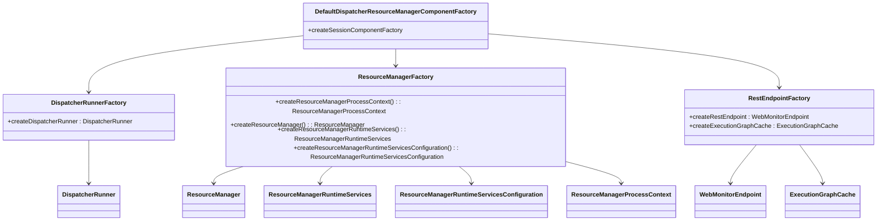
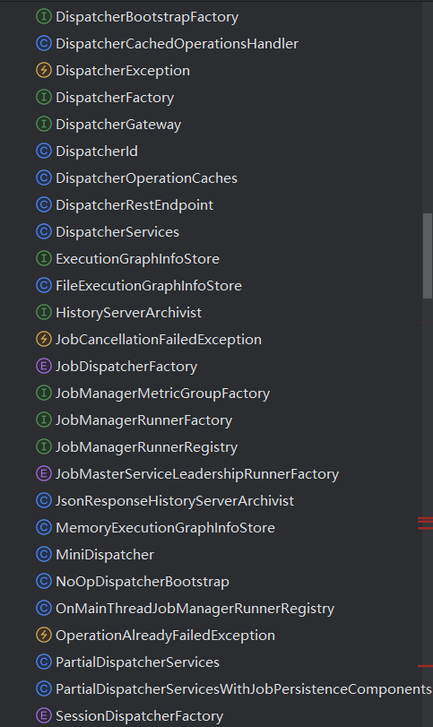
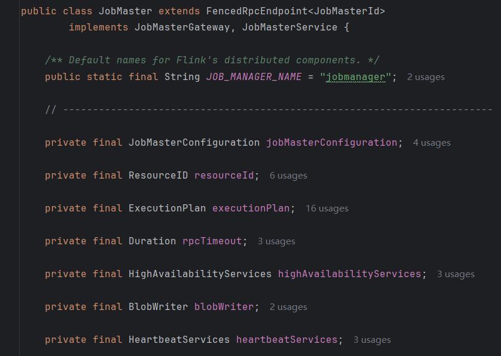
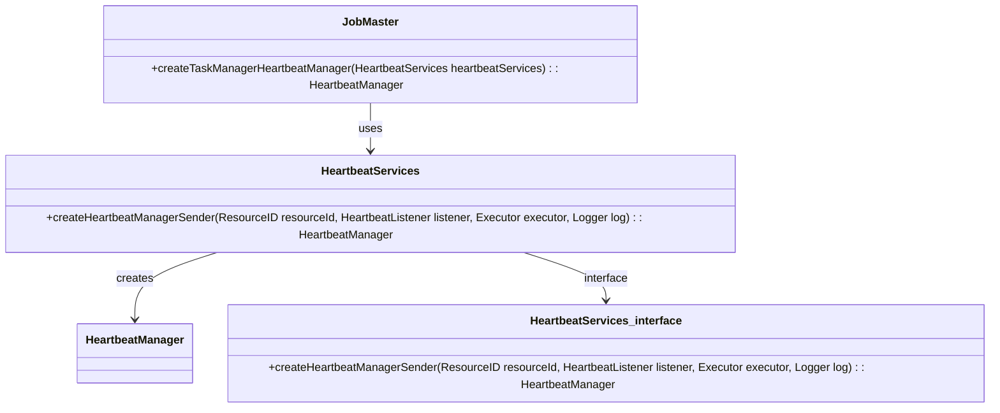
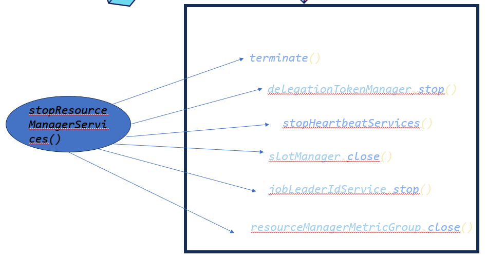

# 高级设计意图

## 1.工厂模式

在Flink-runtime当中，它用到了非常多的工厂模式，我们以entrypoint文件夹下的代码为例。

如我们在StandaloneSessionClusterEntrypoint.java文件下，定义了一个工厂函数：

```java
protected DefaultDispatcherResourceManagerComponentFactory
            createDispatcherResourceManagerComponentFactory(Configuration configuration) {
        return DefaultDispatcherResourceManagerComponentFactory.createSessionComponentFactory(
                StandaloneResourceManagerFactory.getInstance());
    }
```

它可以创造一个工厂类，DefaultDispatcherResourceManagerComponentFactory，createSessionComponentFactory函数的具体实现如下：

```java
 public static DefaultDispatcherResourceManagerComponentFactory createSessionComponentFactory(
            ResourceManagerFactory<?> resourceManagerFactory) {
        return new DefaultDispatcherResourceManagerComponentFactory(
                DefaultDispatcherRunnerFactory.createSessionRunner(
                        SessionDispatcherFactory.INSTANCE),
                resourceManagerFactory,
                SessionRestEndpointFactory.INSTANCE);
    }
```

我们考察这个工厂类：

```java
@Nonnull private final DispatcherRunnerFactory dispatcherRunnerFactory;

    @Nonnull private final ResourceManagerFactory<?> resourceManagerFactory;

    @Nonnull private final RestEndpointFactory<?> restEndpointFactory;

    public DefaultDispatcherResourceManagerComponentFactory(
            @Nonnull DispatcherRunnerFactory dispatcherRunnerFactory,
            @Nonnull ResourceManagerFactory<?> resourceManagerFactory,
            @Nonnull RestEndpointFactory<?> restEndpointFactory) {
        this.dispatcherRunnerFactory = dispatcherRunnerFactory;
        this.resourceManagerFactory = resourceManagerFactory;
        this.restEndpointFactory = restEndpointFactory;
    }
```

可知，它的成员由3个工厂类组成，分别是dispatcherRunnerFactory，resourceManagerFactory，restEndpointFactory。我们继续考察这三个工厂：

dispatcherRunnerFactory：
该接口位于org.apache.flink.runtime.dispatcher.runner，其具体定义为：

```java
public interface DispatcherRunnerFactory {

    DispatcherRunner createDispatcherRunner(
            LeaderElection leaderElection,
            FatalErrorHandler fatalErrorHandler,
            JobPersistenceComponentFactory jobPersistenceComponentFactory,
            Executor ioExecutor,
            RpcService rpcService,
            PartialDispatcherServices partialDispatcherServices)
            throws Exception;
}
```

它包含了一个createDispatcherRunner方法，用于生产一个DispatcherRunner类。

resourceManagerFactory：

改类位于org.apache.flink.runtime.resourcemanager当中，是一个抽象类，它包含了多个方法：

- createResourceManagerProcessContext 创造 ResourceManagerProcessContext类
- createResourceManager（重构）创造 ResourceManager类
- createResourceManager（抽象方法）创造 ResourceManager类
- createResourceManagerRuntimeServices 创造 ResourceManagerRuntimeServices类
- createResourceManagerRuntimeServicesConfiguration 创造 ResourceManagerRuntimeServicesConfiguration类

restEndpointFactory：

位于org.apache.flink.runtime.rest下的一个接口，具体定义为：

```java
public interface RestEndpointFactory<T extends RestfulGateway> {

    WebMonitorEndpoint<T> createRestEndpoint(
            Configuration configuration,
            LeaderGatewayRetriever<DispatcherGateway> dispatcherGatewayRetriever,
            LeaderGatewayRetriever<ResourceManagerGateway> resourceManagerGatewayRetriever,
            TransientBlobService transientBlobService,
            ScheduledExecutorService executor,
            MetricFetcher metricFetcher,
            LeaderElection leaderElection,
            FatalErrorHandler fatalErrorHandler)
            throws Exception;

    static ExecutionGraphCache createExecutionGraphCache(
            RestHandlerConfiguration restConfiguration) {
        return new DefaultExecutionGraphCache(
                restConfiguration.getTimeout(),
                Duration.ofMillis(restConfiguration.getRefreshInterval()));
    }
}
```

其包含两个方法，分别是createRestEndpoint方法创造一个 WebMonitorEndpoint类，和createExecutionGraphCache方法创造一个ExecutionGraphCache类。

所以可以画出类图如下：



这是一个很典型的工厂模式，这样的例子还有许多，这是位于runtime.dispatcher目录下的一些文件，可以看到其中有许多以Factory结尾的文件，这些都是工厂模式的使用。



使用工厂模式，可以更加方便的添加新的产品类，无需修改现有的客户端代码，符合开闭原则。

## 2.代理模式

同时在flink-runtime当中也包含了许多代理模式，我们以org.apache.flink.runtime.jobmaster中的Jobmaster.java文件为例。



我们可以看到该类当中包含了许多类，这里并未截取完全，还有许多类，我们可以看一下这个HeartbeatServices类，以这个类为例来找出当中的代理模式。

HeartbeatServices 是一个类，用于管理心跳机制。心跳机制通常用于分布式系统中，以确保各个节点之间的连接是活跃的。通过定期发送心跳信号，系统可以检测到节点的故障或不可达状态，并采取相应的措施。

我们看看HeartbeatServices的接口（这里代码比较长，我们只需要看其中一部分）：

```java
public interface HeartbeatServices {
    <I, O> HeartbeatManager<I, O> createHeartbeatManager(
            ResourceID resourceId,
            HeartbeatListener<I, O> heartbeatListener,
            ScheduledExecutor mainThreadExecutor,
            Logger log);

   
    <I, O> HeartbeatManager<I, O> createHeartbeatManagerSender(
            ResourceID resourceId,
            HeartbeatListener<I, O> heartbeatListener,
            ScheduledExecutor mainThreadExecutor,
            Logger log);
}

```

接下来我们看JobMaster当中的几个方法：

```java
private HeartbeatManager<Void, Void> createResourceManagerHeartbeatManager(
            HeartbeatServices heartbeatServices) {
        return heartbeatServices.createHeartbeatManager(
                resourceId, new ResourceManagerHeartbeatListener(), getMainThreadExecutor(), log);
    }

private HeartbeatManager<TaskExecutorToJobManagerHeartbeatPayload, AllocatedSlotReport>
            createTaskManagerHeartbeatManager(HeartbeatServices heartbeatServices) {
        return heartbeatServices.createHeartbeatManagerSender(
                resourceId, new TaskManagerHeartbeatListener(), getMainThreadExecutor(), log);
    }
```

这里便使用了HeartbeatServices的方法，但是是在这个类当中使用的，这便实现了一个代理，我们可以画出类图：



代理模式将实际业务逻辑与辅助功能分离，遵循单一职责原则，使代码更清晰、可维护。

## 3.外观模式

Flink当中也有着许多外观模式的例子，我们以ResourceManager为例，位于org.apache.flink.runtime.resourcemanager的ResourceManager.java文件，我们看这个stopResourceManagerServices函数，它的作用是停止资源管理器服务，它具体实现，需要调用 terminate 方法终止框架特定的组件，停止委托令牌管理器，停止心跳服务，关闭插槽管理器等服务，但是我们使用外观模式，就不需要了解它具体是如何关闭资源管理器服务的，直接调用stopResourceManagerServices函数即可，具体代码如下：

```java
private void stopResourceManagerServices() throws Exception {
        Exception exception = null;

        try {
            terminate();
        } catch (Exception e) {
            exception =
                    new ResourceManagerException("Error while shutting down resource manager", e);
        }

        try {
            delegationTokenManager.stop();
        } catch (Exception e) {
            exception = ExceptionUtils.firstOrSuppressed(e, exception);
        }

        stopHeartbeatServices();

        try {
            slotManager.close();
        } catch (Exception e) {
            exception = ExceptionUtils.firstOrSuppressed(e, exception);
        }

        try {
            jobLeaderIdService.stop();
        } catch (Exception e) {
            exception = ExceptionUtils.firstOrSuppressed(e, exception);
        }

        resourceManagerMetricGroup.close();

        clearStateInternal();

        ExceptionUtils.tryRethrowException(exception);
    }

```

我们可以画一个简单的图：



